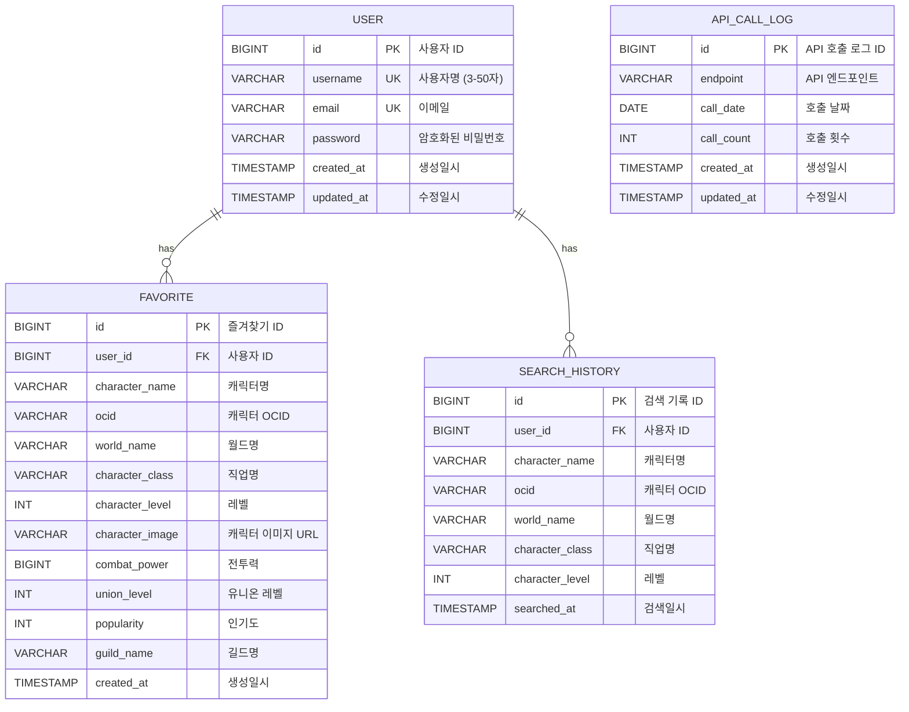

# 📊 MapleProject E-R Diagram

## Entity Relationship Diagram (Mermaid)



---

## 📋 엔티티 상세 설명

### 1. USER (사용자)

**설명**: 서비스를 이용하는 회원 정보

| 컬럼명 | 데이터 타입 | 제약조건 | 설명 |
|--------|------------|---------|------|
| id | BIGINT | PK, AUTO_INCREMENT | 사용자 고유 ID |
| username | VARCHAR(50) | UNIQUE, NOT NULL | 사용자명 (3-50자) |
| email | VARCHAR(100) | UNIQUE, NOT NULL | 이메일 주소 |
| password | VARCHAR(255) | NOT NULL | BCrypt 암호화된 비밀번호 |
| created_at | TIMESTAMP | DEFAULT CURRENT_TIMESTAMP | 생성일시 |
| updated_at | TIMESTAMP | ON UPDATE CURRENT_TIMESTAMP | 수정일시 |

**비즈니스 규칙**:
- username은 3-50자 사이여야 함
- email은 유효한 이메일 형식이어야 함
- password는 6자 이상이어야 하며, BCrypt로 암호화됨

---

### 2. FAVORITE (즐겨찾기)

**설명**: 사용자가 즐겨찾기로 등록한 캐릭터 정보

| 컬럼명 | 데이터 타입 | 제약조건 | 설명 |
|--------|------------|---------|------|
| id | BIGINT | PK, AUTO_INCREMENT | 즐겨찾기 고유 ID |
| user_id | BIGINT | FK, NOT NULL | 사용자 ID (USER 테이블 참조) |
| character_name | VARCHAR(50) | NOT NULL | 캐릭터명 |
| ocid | VARCHAR(100) | | 넥슨 Open Character ID |
| world_name | VARCHAR(50) | | 월드명 (리부트, 베라 등) |
| character_class | VARCHAR(50) | | 직업명 (아델, 나이트로드 등) |
| character_level | INT | | 캐릭터 레벨 |
| character_image | VARCHAR(255) | | 캐릭터 이미지 URL |
| combat_power | BIGINT | | 전투력 |
| union_level | INT | | 유니온 레벨 |
| popularity | INT | | 인기도 |
| guild_name | VARCHAR(100) | | 길드명 |
| created_at | TIMESTAMP | DEFAULT CURRENT_TIMESTAMP | 생성일시 |

**비즈니스 규칙**:
- 한 사용자가 같은 캐릭터를 중복으로 즐겨찾기할 수 없음
- user_id가 삭제되면 해당 즐겨찾기도 함께 삭제 (CASCADE)

---

### 3. SEARCH_HISTORY (검색 기록)

**설명**: 사용자의 캐릭터 검색 기록

| 컬럼명 | 데이터 타입 | 제약조건 | 설명 |
|--------|------------|---------|------|
| id | BIGINT | PK, AUTO_INCREMENT | 검색 기록 고유 ID |
| user_id | BIGINT | FK, NOT NULL | 사용자 ID (USER 테이블 참조) |
| character_name | VARCHAR(50) | NOT NULL | 검색한 캐릭터명 |
| ocid | VARCHAR(100) | | 넥슨 Open Character ID |
| world_name | VARCHAR(50) | | 월드명 |
| character_class | VARCHAR(50) | | 직업명 |
| character_level | INT | | 캐릭터 레벨 |
| searched_at | TIMESTAMP | DEFAULT CURRENT_TIMESTAMP | 검색일시 |

**비즈니스 규칙**:
- 로그인한 사용자만 검색 기록이 저장됨
- 최근 검색 기록부터 표시 (searched_at DESC)
- user_id가 삭제되면 해당 검색 기록도 함께 삭제 (CASCADE)

---

### 4. API_CALL_LOG (API 호출 로그)

**설명**: Nexon API 호출 통계 관리 (일일 제한 9000건 관리용)

| 컬럼명 | 데이터 타입 | 제약조건 | 설명 |
|--------|------------|---------|------|
| id | BIGINT | PK, AUTO_INCREMENT | 로그 고유 ID |
| endpoint | VARCHAR(255) | NOT NULL | API 엔드포인트 |
| call_date | DATE | NOT NULL | 호출 날짜 |
| call_count | INT | DEFAULT 0 | 호출 횟수 |
| created_at | TIMESTAMP | DEFAULT CURRENT_TIMESTAMP | 생성일시 |
| updated_at | TIMESTAMP | ON UPDATE CURRENT_TIMESTAMP | 수정일시 |

**비즈니스 규칙**:
- endpoint와 call_date의 조합은 UNIQUE
- Nexon API는 일일 9000건 제한이 있음
- 매일 자정에 call_count 초기화

---

## 🔗 관계 설명

### 1. USER ↔ FAVORITE (1:N)
- **관계**: 한 명의 사용자는 여러 개의 즐겨찾기를 가질 수 있음
- **카디널리티**: 1:N
- **참조 무결성**: CASCADE DELETE
- **설명**: 사용자가 탈퇴하면 해당 사용자의 모든 즐겨찾기도 삭제됨

### 2. USER ↔ SEARCH_HISTORY (1:N)
- **관계**: 한 명의 사용자는 여러 개의 검색 기록을 가질 수 있음
- **카디널리티**: 1:N
- **참조 무결성**: CASCADE DELETE
- **설명**: 사용자가 탈퇴하면 해당 사용자의 모든 검색 기록도 삭제됨

### 3. API_CALL_LOG (독립 엔티티)
- **관계**: 다른 엔티티와 독립적으로 존재
- **설명**: 시스템 전체의 API 호출 통계를 관리하며, 사용자와 무관하게 운영됨

---

## 💾 SQL DDL

### USER 테이블

```sql
CREATE TABLE users (
    id BIGINT AUTO_INCREMENT PRIMARY KEY,
    username VARCHAR(50) UNIQUE NOT NULL,
    email VARCHAR(100) UNIQUE NOT NULL,
    password VARCHAR(255) NOT NULL,
    created_at TIMESTAMP DEFAULT CURRENT_TIMESTAMP,
    updated_at TIMESTAMP DEFAULT CURRENT_TIMESTAMP ON UPDATE CURRENT_TIMESTAMP,
    INDEX idx_username (username),
    INDEX idx_email (email)
) ENGINE=InnoDB DEFAULT CHARSET=utf8mb4 COLLATE=utf8mb4_unicode_ci;
```

### FAVORITE 테이블

```sql
CREATE TABLE favorites (
    id BIGINT AUTO_INCREMENT PRIMARY KEY,
    user_id BIGINT NOT NULL,
    character_name VARCHAR(50) NOT NULL,
    ocid VARCHAR(100),
    world_name VARCHAR(50),
    character_class VARCHAR(50),
    character_level INT,
    character_image VARCHAR(255),
    combat_power BIGINT,
    union_level INT,
    popularity INT,
    guild_name VARCHAR(100),
    created_at TIMESTAMP DEFAULT CURRENT_TIMESTAMP,
    FOREIGN KEY (user_id) REFERENCES users(id) ON DELETE CASCADE,
    INDEX idx_user_id (user_id),
    INDEX idx_character_name (character_name),
    UNIQUE KEY unique_user_character (user_id, character_name)
) ENGINE=InnoDB DEFAULT CHARSET=utf8mb4 COLLATE=utf8mb4_unicode_ci;
```

### SEARCH_HISTORY 테이블

```sql
CREATE TABLE search_history (
    id BIGINT AUTO_INCREMENT PRIMARY KEY,
    user_id BIGINT NOT NULL,
    character_name VARCHAR(50) NOT NULL,
    ocid VARCHAR(100),
    world_name VARCHAR(50),
    character_class VARCHAR(50),
    character_level INT,
    searched_at TIMESTAMP DEFAULT CURRENT_TIMESTAMP,
    FOREIGN KEY (user_id) REFERENCES users(id) ON DELETE CASCADE,
    INDEX idx_user_id (user_id),
    INDEX idx_searched_at (searched_at DESC)
) ENGINE=InnoDB DEFAULT CHARSET=utf8mb4 COLLATE=utf8mb4_unicode_ci;
```

### API_CALL_LOG 테이블

```sql
CREATE TABLE api_call_log (
    id BIGINT AUTO_INCREMENT PRIMARY KEY,
    endpoint VARCHAR(255) NOT NULL,
    call_date DATE NOT NULL,
    call_count INT DEFAULT 0,
    created_at TIMESTAMP DEFAULT CURRENT_TIMESTAMP,
    updated_at TIMESTAMP DEFAULT CURRENT_TIMESTAMP ON UPDATE CURRENT_TIMESTAMP,
    UNIQUE KEY unique_endpoint_date (endpoint, call_date),
    INDEX idx_call_date (call_date)
) ENGINE=InnoDB DEFAULT CHARSET=utf8mb4 COLLATE=utf8mb4_unicode_ci;
```

---

## 📊 데이터 예시

### USER 테이블 샘플 데이터

| id | username | email | password | created_at |
|----|----------|-------|----------|------------|
| 1 | 정아형 | student@kopo.ac.kr | $2a$10$... | 2024-12-01 10:00:00 |
| 2 | maple_lover | maple@example.com | $2a$10$... | 2024-12-02 11:30:00 |

### FAVORITE 테이블 샘플 데이터

| id | user_id | character_name | world_name | character_class | character_level |
|----|---------|----------------|------------|-----------------|-----------------|
| 1 | 1 | 융도도리 | 리부트 | 아델 | 279 |
| 2 | 1 | 검은호 | 리부트 | 나이트로드 | 293 |
| 3 | 2 | 햄찡 | 베라 | 소울마스터 | 288 |

### SEARCH_HISTORY 테이블 샘플 데이터

| id | user_id | character_name | world_name | searched_at |
|----|---------|----------------|------------|-------------|
| 1 | 1 | 융도도리 | 리부트 | 2024-12-10 14:30:00 |
| 2 | 1 | 검은호 | 리부트 | 2024-12-10 15:00:00 |
| 3 | 2 | 햄찡 | 베라 | 2024-12-11 10:20:00 |

---

## 🎯 인덱스 전략

### 성능 최적화를 위한 인덱스

1. **USER 테이블**
   - `idx_username`: 로그인 시 사용자명 조회
   - `idx_email`: 로그인 시 이메일 조회

2. **FAVORITE 테이블**
   - `idx_user_id`: 사용자별 즐겨찾기 조회
   - `idx_character_name`: 캐릭터명 검색
   - `unique_user_character`: 중복 방지

3. **SEARCH_HISTORY 테이블**
   - `idx_user_id`: 사용자별 검색 기록 조회
   - `idx_searched_at`: 최근 검색 기록 정렬

4. **API_CALL_LOG 테이블**
   - `unique_endpoint_date`: 일일 통계 중복 방지
   - `idx_call_date`: 날짜별 조회

---

## 🔐 데이터 보안

1. **비밀번호 암호화**: BCrypt 알고리즘 사용
2. **개인정보 보호**: 이메일, 비밀번호는 암호화 저장
3. **참조 무결성**: FOREIGN KEY 제약조건으로 데이터 일관성 유지
4. **CASCADE DELETE**: 사용자 탈퇴 시 관련 데이터 자동 삭제

---

## 📝 정규화 수준

현재 데이터베이스는 **제3정규형(3NF)**을 만족합니다:

1. **제1정규형(1NF)**: 모든 컬럼이 원자값을 가짐
2. **제2정규형(2NF)**: 부분 함수 종속성 제거
3. **제3정규형(3NF)**: 이행 함수 종속성 제거

---

## 🎨 보고서용 다이어그램

위의 Mermaid 코드를 다음 사이트에서 시각화할 수 있습니다:

1. **Mermaid Live Editor**: https://mermaid.live/
2. **GitHub Markdown**: GitHub에서 자동 렌더링
3. **draw.io**: 수동으로 예쁘게 그리기

또는 이 파일을 GitHub에 올리면 자동으로 다이어그램이 렌더링됩니다!
